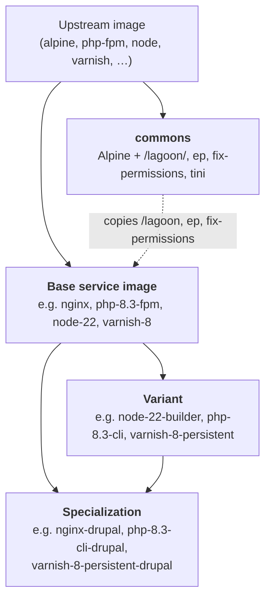
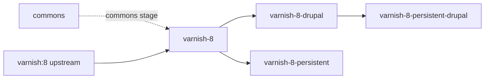
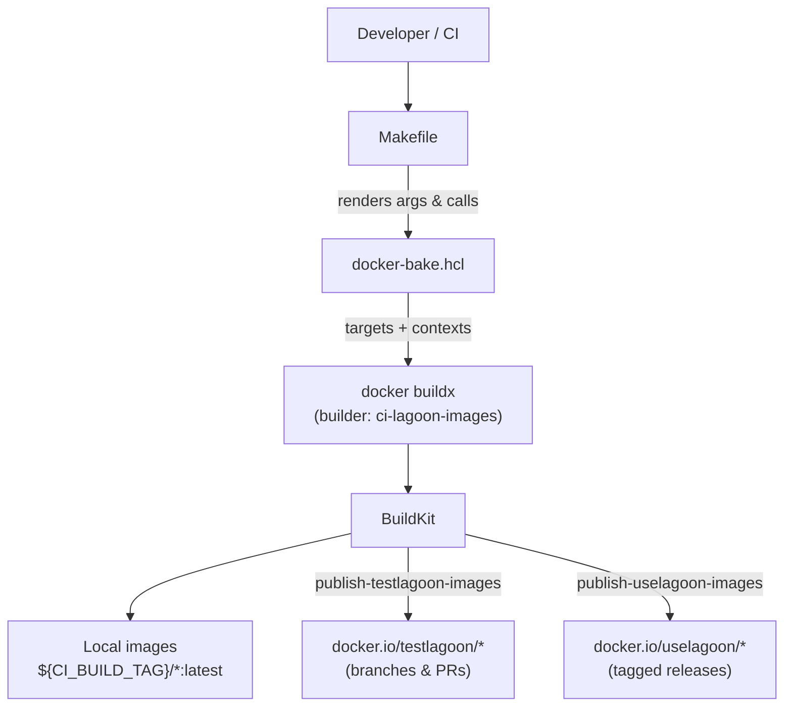
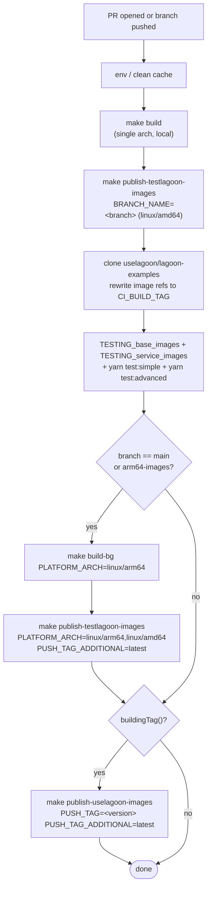
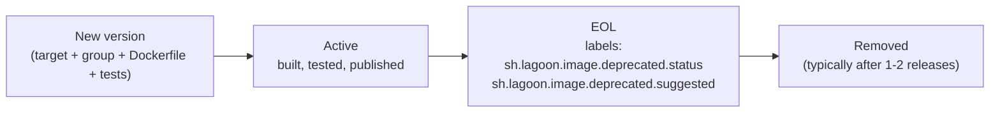

# Lagoon Images — Architecture

This document is the **reference description** of how the `lagoon-images`
repository is structured: what it builds, how the build system is wired,
how images relate to one another, and how they flow from source to
published artifacts.

It is intended for maintainers and reviewers who need to understand *why*
the repo is shaped the way it is. For task-oriented "how do I add / remove
/ test an image?" recipes, see [.github/copilot-instructions.md](.github/copilot-instructions.md).

---

## 1. Purpose & scope

`lagoon-images` produces the **base container images** that
[Lagoon](https://github.com/uselagoon/lagoon) uses to host Drupal, PHP and
related workloads on Kubernetes. Every image in this repository is:

- **Alpine-based** (directly or transitively, via `commons`).
- **Built and published as multi-arch** (`linux/amd64` + `linux/arm64`) on
  the `main` branch and on tagged releases.
- **Composed of a small foundation image (`commons`) plus a layered tree
  of service / variant images** that all reuse the same entrypoint and
  utility scripts.

The images themselves are consumed by Lagoon project repositories via
their `docker-compose.yml` `image:` references — they are *base* images,
not application images.

---

## 2. Repository layout

```
lagoon-images/
├── architecture.md                     ← you are here
├── docker-bake.hcl                     ← single source of truth for all build targets
├── Makefile                            ← thin wrapper around `docker buildx bake`
├── Jenkinsfile                         ← CI: build → test → publish
├── README.md
├── renovate.json                       ← upstream version bumps
├── build.txt / scan.txt                ← generated cross-reference tables
│
├── docs/
│   └── reviewing/
│       └── PR_REVIEW_RUBRIC.md         ← PR review context/rationale
│
├── helpers/                            ← test harness consumed by Jenkins
│   ├── images-docker-compose.yml       ← compose stack for "base image" tests
│   ├── services-docker-compose.yml     ← compose stack for "service image" tests
│   ├── TESTING_base_images_dockercompose.md
│   └── TESTING_service_images_dockercompose.md
│
├── images/                             ← one folder per image family
│   ├── commons/                        ← the foundation
│   ├── nginx/        nginx-drupal/
│   ├── php-fpm/      php-cli/    php-cli-drupal/
│   ├── node/         node-builder/  node-cli/
│   ├── mariadb/      mariadb-drupal/
│   ├── mysql/        postgres/   postgres-drupal/
│   ├── solr/         solr-drupal/
│   ├── varnish/      varnish-drupal/   varnish-persistent/   varnish-persistent-drupal/
│   ├── redis/        redis-persistent/   valkey/
│   ├── rabbitmq/     rabbitmq-cluster/
│   ├── opensearch/   mongo/
│   └── python/       ruby/
│
├── build/                              ← empty marker files (build cache)
└── scans/                              ← Syft / Grype output
```

Every `images/<family>/` folder contains either a single `Dockerfile`
(for single-version images like `nginx`) or one `<version>.Dockerfile`
per supported version (e.g. `8.3.Dockerfile`, `8.4.Dockerfile`).

---

## 3. The image hierarchy

### 3.1 Naming convention

```
{service}-{version}[-variant][-specialization]
```

| Token            | Meaning                                                    | Examples                                  |
| ---------------- | ---------------------------------------------------------- | ----------------------------------------- |
| `service`        | Software being packaged                                    | `php`, `node`, `varnish`, `postgres`      |
| `version`        | Major (or major.minor) upstream version                    | `8.3`, `22`, `8`, `17`                    |
| `variant`        | Form factor of the same software                           | `fpm`, `cli`, `builder`, `persistent`     |
| `specialization` | Workload-specific tuning (almost always Drupal)            | `drupal`                                  |

Examples that exercise the full pattern:

- `php-8.3-fpm` — service + version + variant
- `php-8.3-cli-drupal` — service + version + variant + specialization
- `varnish-8-persistent-drupal` — service + version + variant + specialization
- `node-22-builder` — service + version + variant

### 3.2 Dependency tiers

Every image fits into one of four tiers:



Key rules:

1. **Every image transitively depends on `commons`.** First-tier images
   (those that build directly `FROM upstream:version`) pull commons in
   as a *named build stage* and copy `/lagoon`, `/bin/ep` and
   `/bin/fix-permissions` from it.
2. **Variants and specializations build `FROM` their parent Lagoon
   image**, not from upstream. They do *not* re-stage commons.
3. **A combined specialization** (e.g. `varnish-8-persistent-drupal`)
   chains from the most specific parent already produced (here:
   `varnish-8-drupal`).

### 3.3 A worked example: the `varnish-8` family



- `varnish-8` adds Lagoon entrypoints and `/lagoon` tooling to upstream.
- `varnish-8-drupal` layers in Drupal-specific VCL.
- `varnish-8-persistent` swaps the cache backend to file-backed storage.
- `varnish-8-persistent-drupal` combines both — and is layered on
  `varnish-8-drupal` (the *first* specialization), not on
  `varnish-8-persistent`.

The same pattern is used across `node-*`, `php-*`, `redis-*`,
`postgres-*`, `mariadb-*`, `solr-*`, etc.

---

## 4. The `commons` foundation

`commons` is intentionally minimal. It provides:

| Path                          | Purpose                                                        |
| ----------------------------- | -------------------------------------------------------------- |
| `/lagoon/entrypoints/`        | Numbered shell scripts run on container start                  |
| `/lagoon/entrypoints.sh`      | Sources every file in `/lagoon/entrypoints/` alphabetically    |
| `/lagoon/bin/cron`            | `go-crond` binary for in-container cron                        |
| `/bin/ep`                     | `envplate` — environment variable templating in config files   |
| `/bin/fix-permissions`        | Make a path writable by the running (often unknown) UID        |
| `/bin/fix-dir-permissions`    | Directory-only variant                                          |
| `/bin/docker-sleep`           | Default `CMD` for "do nothing" containers                      |
| `/bin/wait-for`               | TCP wait helper                                                 |
| `/bin/entrypoint-readiness`   | Readiness probe helper                                          |
| `/sbin/tini`                  | PID 1 / signal handling                                         |

The container `ENTRYPOINT` is always `tini → /lagoon/entrypoints.sh`.
This means **every Lagoon image inherits the same boot sequence**, and a
service image extends it simply by dropping a numbered script into
`/lagoon/entrypoints/` (e.g. `10-php-fpm.sh`, `50-ssh-client.sh`).

---

## 5. The build system

### 5.1 Architecture



### 5.2 `docker-bake.hcl` — the single source of truth

`docker-bake.hcl` declares **every image, its dependencies, and its
published tags**. There is no scripted build graph elsewhere; if it isn't
in bake, it isn't built.

It contains four kinds of declaration:

**1. Variables** — knobs supplied by the Makefile / CI environment:

| Variable              | Default              | Used for                                              |
| --------------------- | -------------------- | ----------------------------------------------------- |
| `LOCAL_REPO`          | `lagoon`             | Prefix used for inter-image `FROM`/`contexts` lookups |
| `LOCAL_TAG`           | `latest`             | Tag for locally-built images                          |
| `LAGOON_VERSION`      | `development`        | Embedded in image label and `/lagoon/version`         |
| `PUSH_REPO`           | `ghcr.io/uselagoon`  | Registry prefix for `tags()`                          |
| `PUSH_TAG`            | `latest`             | Primary published tag                                 |
| `PUSH_TAG_ADDITIONAL` | `""`                 | Optional second tag (e.g. `latest` on a release)      |
| `PLATFORMS`           | `linux/amd64`        | Comma-separated buildx platforms                      |
| `NO_CACHE`            | `false`              | Force layer rebuilds                                  |

**2. The `default` target** — inherited by every image target. It sets
platforms, OCI labels, `no-cache`, and the build args
(`LAGOON_VERSION`, `PUSH_REPO`, `PUSH_TAG`, `LOCAL_REPO`).

**3. Per-image targets** — one per buildable image:

```hcl
target "php-8-3-fpm" {
  inherits   = ["default"]
  context    = "images/php-fpm"
  dockerfile = "8.3.Dockerfile"
  tags       = tags("php-8.3-fpm")
  contexts   = {
    "${LOCAL_REPO}/commons": "target:commons"
  }
}
```

Two naming details to keep straight:

- **Target name** uses dashes (`php-8-3-fpm`) because HCL identifiers
  cannot contain dots.
- **Tag name** (passed to `tags()`) keeps the dotted form
  (`php-8.3-fpm`) because that is the public image name.

The `contexts` map is how dependencies are wired. The key is the name a
child Dockerfile references in its `FROM ${LOCAL_REPO}/<name>` line, and
the value is `target:<other-bake-target>`. BuildKit uses this to build
the dependency first and pin the child to its locally-built tag instead
of pulling from a registry.

**4. Groups** — convenience aggregations:

- `default` — every image in the repo.
- One per service family (`php`, `node`, `varnish`, `postgres`, …).

A new image must be added to its family group **and** to `default`,
otherwise `make build` and CI will silently skip it.

### 5.3 The `tags()` function

```hcl
function "tags" {
  params = [image]
  result = notequal(PUSH_TAG_ADDITIONAL, "")
    ? ["${PUSH_REPO}/${image}:${PUSH_TAG}",
       "${PUSH_REPO}/${image}:${PUSH_TAG_ADDITIONAL}"]
    : ["${PUSH_REPO}/${image}:${PUSH_TAG}"]
}
```

This is what produces `docker.io/testlagoon/nginx:my-branch` during a PR
build and `docker.io/uselagoon/nginx:v2.20.0` + `…:latest` on a tagged
release — the Makefile flips the variables, bake re-renders the tags.

### 5.4 The Makefile

The Makefile is intentionally thin — it only sets variables and calls
`docker buildx bake`. The interesting recipes:

| Target                          | Effect                                                                  |
| ------------------------------- | ----------------------------------------------------------------------- |
| `make build`                    | Build all targets, load into local Docker (single platform)             |
| `make build-bg`                 | Same as `build`, but no `--load` (used for multi-arch CI builds)        |
| `make build/<image>`            | Build one target *and its parents* (dots map to dashes automatically)   |
| `make build-list`               | Print every `build/<target>` recipe                                     |
| `make build-tags`               | Print every published tag bake would produce                            |
| `make scan-images`              | Run Syft + Grype over every produced tag, write to `scans/`             |
| `make publish-testlagoon-images`| Push to `docker.io/testlagoon/<image>:${BRANCH_NAME}`                   |
| `make publish-uselagoon-images` | Push to `docker.io/uselagoon/<image>:${LAGOON_VERSION}` + `:latest`     |
| `make docker_buildx_create`     | Create the dedicated `ci-lagoon-images` buildx builder                  |

Per-image build markers are written to `build/` so repeated invocations
short-circuit; `make clean` removes them to force a rebuild.

---

## 6. CI / publishing flow



Notes on the pipeline ([Jenkinsfile](Jenkinsfile)):

- **`CI_BUILD_TAG`** is derived from the branch + build number and used
  as `LOCAL_REPO`, so concurrent CI runs cannot collide on local image
  names.
- **Tests run against the just-built local images**, not against
  `uselagoon/*`. The test stage rewrites `uselagoon` to `${CI_BUILD_TAG}`
  in every cloned compose / Dockerfile reference.
- **Multi-arch (`linux/arm64`) is only built on `main` and tagged
  releases.** PR builds are amd64-only to keep cycle time tractable.
- **Tagged releases** are the only path to `docker.io/uselagoon/*`.

---

## 7. Dockerfile conventions

### 7.1 First-tier images (`FROM upstream`)

```dockerfile
ARG LOCAL_REPO
FROM ${LOCAL_REPO:-lagoon}/commons AS commons
FROM upstream:version

ARG LAGOON_VERSION
ENV LAGOON_VERSION=$LAGOON_VERSION

LABEL org.opencontainers.image.authors="The Lagoon Authors"
LABEL org.opencontainers.image.source="https://github.com/uselagoon/lagoon-images/blob/main/images/<family>/<file>"
LABEL org.opencontainers.image.description="…"
LABEL org.opencontainers.image.title="uselagoon/<image>"
LABEL org.opencontainers.image.base.name="docker.io/upstream:version"

ENV LAGOON=<service-name>

COPY --from=commons /lagoon /lagoon
COPY --from=commons /bin/fix-permissions /bin/ep /bin/

# … service-specific RUN, COPY, ENTRYPOINT overrides …
```

### 7.2 Variants / specializations (`FROM` a Lagoon parent)

```dockerfile
ARG LOCAL_REPO
FROM ${LOCAL_REPO:-lagoon}/varnish-8-drupal

LABEL org.opencontainers.image.source="…"
LABEL org.opencontainers.image.description="…"
LABEL org.opencontainers.image.title="uselagoon/varnish-8-persistent-drupal"
LABEL org.opencontainers.image.base.name="docker.io/uselagoon/varnish-8-drupal"

# … only the diff vs the parent …
```

The `ARG LOCAL_REPO` + `FROM ${LOCAL_REPO:-lagoon}/...` pattern is what
allows the same Dockerfile to resolve to:

- `lagoon/varnish-8-drupal` during a developer's local `make build`,
- `lagoon<branch-buildnumber>/varnish-8-drupal` during CI, and
- `docker.io/uselagoon/varnish-8-drupal` when consumed downstream.

### 7.3 The "commons-as-build-stage" exception

A handful of images (e.g. `solr-9-drupal`) need commons during build
even though they themselves derive from a Lagoon parent — typically to
use `git`/`curl` from commons to fetch supplemental assets. These
declare commons as a *named stage* and **must also list commons in their
bake `contexts`**:

```hcl
target "solr-9-drupal" {
  contexts = {
    "${LOCAL_REPO}/solr-9":  "target:solr-9",
    "${LOCAL_REPO}/commons": "target:commons"
  }
}
```

---

## 8. Testing

### 8.1 Two test surfaces

| Surface           | Compose file                        | Test commands                                |
| ----------------- | ----------------------------------- | -------------------------------------------- |
| Base images       | `helpers/images-docker-compose.yml` | `helpers/TESTING_base_images_dockercompose.md`     |
| Service images    | `helpers/services-docker-compose.yml` | `helpers/TESTING_service_images_dockercompose.md` |

"Base images" cover language runtimes and HTTP servers (`commons`,
`php-fpm`, `node`, `python`, `ruby`, `nginx`, `varnish`, …). "Service
images" cover stateful services (`mariadb`, `mysql`, `postgres`,
`redis`, `valkey`, `rabbitmq`, `opensearch`, `mongo`, `solr`).

### 8.2 What the test markdown actually is

The `TESTING_*_dockercompose.md` files are **executable specifications**:
they are parsed by `yarn test` (in the `lagoon-examples` repo) which
extracts each fenced shell block and runs it. The first matching grep
pattern decides pass/fail.

### 8.3 How CI runs them

1. Jenkins clones [`uselagoon/lagoon-examples`](https://github.com/uselagoon/lagoon-examples).
2. It copies `helpers/*-docker-compose.yml` and `helpers/TESTING_*.md`
   into `tests/all-images/`.
3. It rewrites `uselagoon` → `${CI_BUILD_TAG}` so the tests run against
   the locally-built images.
4. It runs four suites in order: base images, service images, simple
   Drupal, advanced Drupal.

### 8.4 Local equivalent

```bash
cp helpers/images-docker-compose.yml docker-compose.yml
sed -i '' 's/uselagoon/lagoon/g' docker-compose.yml   # macOS sed
docker compose up -d <service>
# run individual command from TESTING_*.md
docker compose down && rm docker-compose.yml
```

---

## 9. Security & supply-chain scanning

`make scan-images` runs after every published build:

- **Syft** — SBOM per tag → `scans/<image>.syft.txt`
- **Grype** — vulnerability scan per tag → `scans/<image>.grype.txt`

Outputs are committed in CI to feed both the Lagoon platform's
deprecation/EOL warning system and OpenSSF Scorecard reporting.

The repository carries an [OpenSSF Best Practices badge](https://www.bestpractices.dev/projects/11411)
and an OpenSSF Scorecard, both surfaced in the [README](README.md).

---

## 10. Image lifecycle



Two distinct phases:

1. **EOL marking.** The image keeps building and publishing but carries
   `sh.lagoon.image.deprecated.status="endoflife"` and a
   `sh.lagoon.image.deprecated.suggested` label pointing at the
   recommended successor. Scanners and the Lagoon platform surface this
   to users.
2. **Removal.** Typically after 1-2 releases with EOL warnings, the image is
   deleted from `images/`, its bake target and group memberships are
   removed, and its compose entry + test commands are stripped from
   `helpers/`.
3. **Lagoon Reporting.** Lagoon Builds will always mark these images as
   deprecated for as long as the image remains published and available.
   In some faster-moving images, the replacement image may also have been
   marked deprecated, but can't be resolved without republishing.

For the precise mechanics of these phases, see the EOL section in
[.github/copilot-instructions.md](.github/copilot-instructions.md).

---

## 11. Where to look next

| If you want to…                                | Read                                                       |
| ---------------------------------------------- | ---------------------------------------------------------- |
| Add, remove, or test an image                  | [.github/copilot-instructions.md](.github/copilot-instructions.md) |
| Review a PR                                    | [.github/instructions/pr-review.instructions.md](.github/instructions/pr-review.instructions.md) |
| Understand build orchestration                 | [docker-bake.hcl](docker-bake.hcl), [Makefile](Makefile)   |
| Understand the CI flow                         | [Jenkinsfile](Jenkinsfile)                                 |
| Understand the entrypoint / commons utilities  | [images/commons/](images/commons)                          |
| Run or extend the test suites                  | [helpers/](helpers)                                        |
